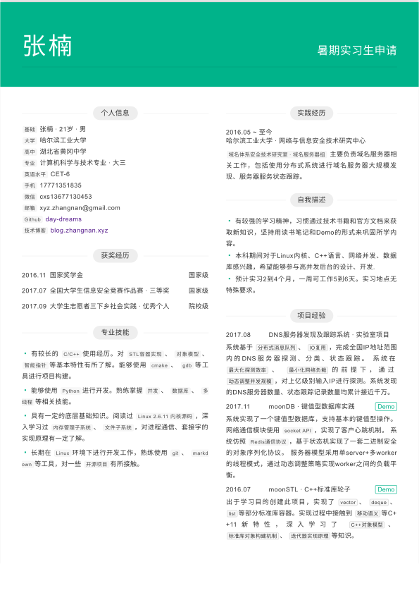

## 我的简历

[pdf版](resume.pdf)



## 使用方法

* clone项目,编辑src/index.html
* 安装cnpm
* 安装依赖:```cnpm install```
* 生成网页:```npm run rebuild```
* 打开index.html预览.

## 感谢

简历模板借鉴自　[@ Cong Min](https://congm.in),调整了部分css.